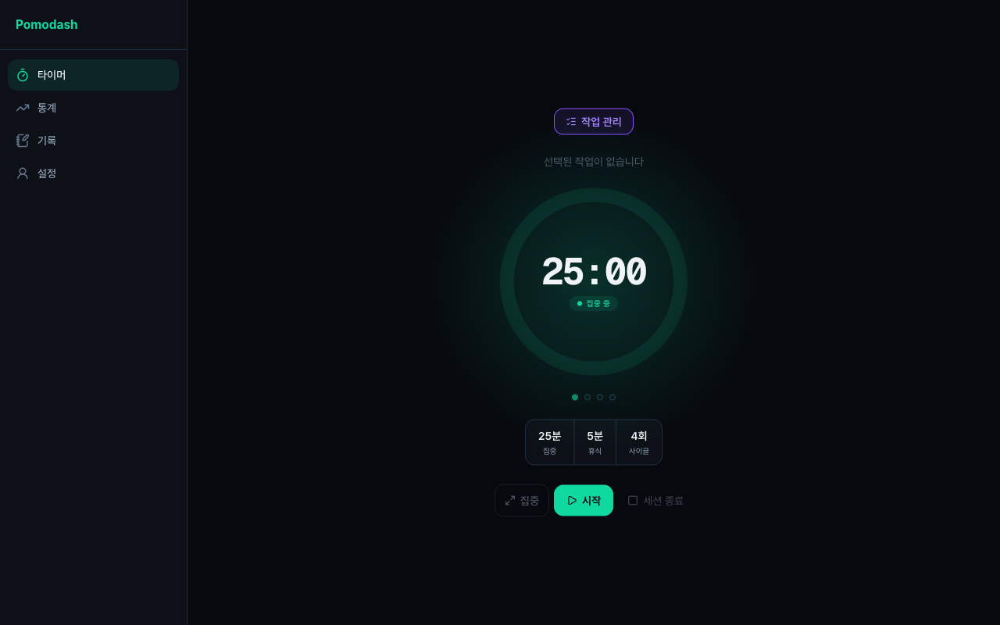
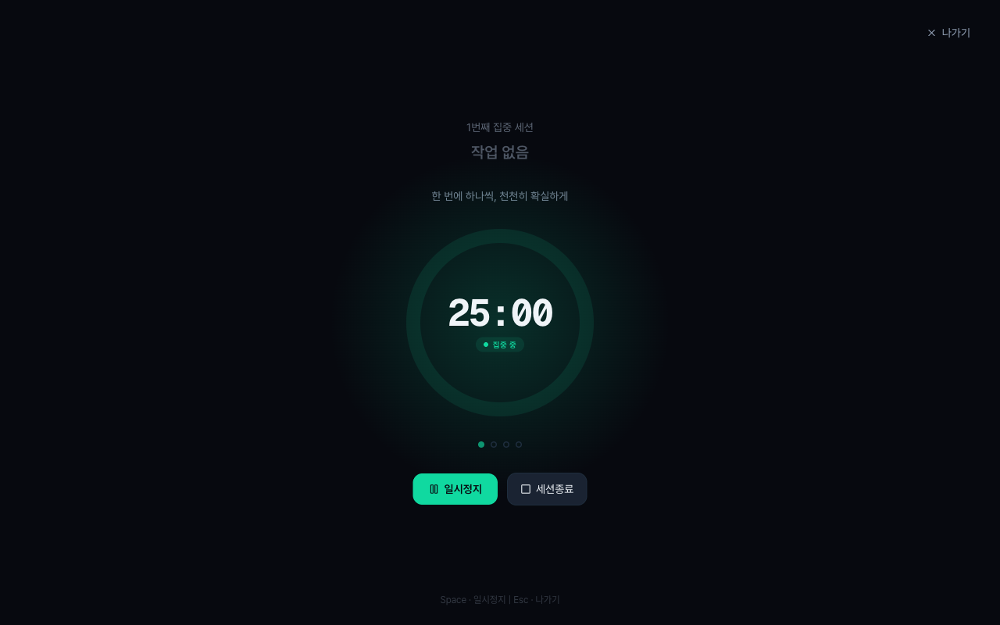
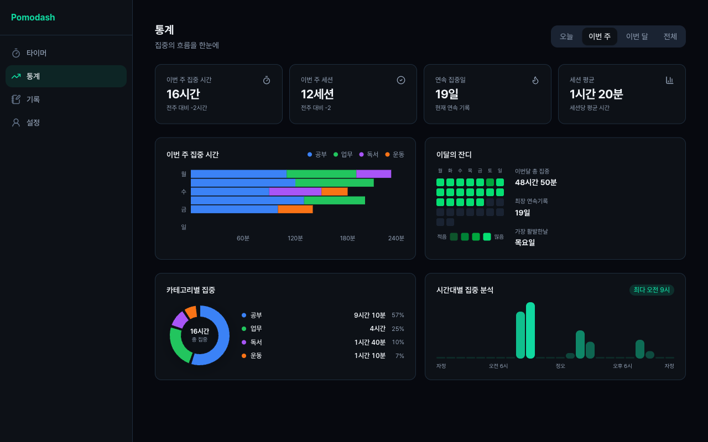

# Pomodash

[](https://pomodash-three.vercel.app) [](./LICENSE)

계획하고, 집중하고, 기록한다

수험생과 취업 준비생을 위한 포모도로 기반 집중 도구. 로그인 없이 바로 쓸 수 있고 모든 데이터는 브라우저에 저장된다.

## 스크린샷

<div align="center">
  
  
  
</div>

## 주요 기능

| | 기능 | 설명 |
|---|---|---|
| ⏱ | **포모도로 타이머** | 절대시간 기반, 백그라운드 탭 드리프트 없음 |
| 📋 | **작업 관리** | 카테고리별 작업 생성 및 목표 사이클 설정 |
| 🎯 | **집중 모드** | 타이머만 남기고 방해 요소 최소화 |
| 📝 | **세션 기록** | 회고 메모 + 집중 구간 타임라인 |
| 📊 | **대시보드** | 일/주/월 집중 시간 시각화 + 스트릭 |
| 🌙 | **다크/라이트 모드** | 시스템 설정 연동, 수동 전환 가능 |

## 개발 가이드

### 요구사항

Node.js 22+, npm

### 설치 및 실행

```bash
git clone https://github.com/aaaz425/pomodash.git
cd pomodash
npm install
npm run dev
```

`http://localhost:3000`에 접속

### 명령어

| 명령어 | 설명 |
|--------|------|
| `npm run dev` | 로컬 개발 서버 |
| `npm run build` | 프로덕션 빌드 (커밋 전 통과 확인) |
| `npm run lint` | 린트 |
| `npm run test` | 단위 테스트 (Vitest) |
| `npm run test:e2e` | E2E 테스트 (Playwright) |

### 환경 변수

모두 선택 사항 — 없어도 로컬 개발에 영향 없음. `.env.local.example` 참고

| 변수 | 설명 |
|------|------|
| `NEXT_PUBLIC_POSTHOG_KEY` | Posthog 이벤트 추적 API 키 |
| `NEXT_PUBLIC_POSTHOG_HOST` | Posthog 호스트 (기본값: `https://app.posthog.com`) |

### 프로젝트 구조

```
app/           # 라우트 세그먼트 (비즈니스 로직 금지)
components/    # UI 컴포넌트 — feature별 폴더 + shared/
store/         # Zustand 전역 상태
hooks/         # 브라우저 API 추상화 훅
lib/           # 순수 유틸리티 (스토리지, 분석, 알림 등)
types/         # 공유 TypeScript 타입 (index.ts 단일 파일)
docs/          # 프로젝트 문서
```

### 산출물 (Specs)

| 문서 | 내용 |
|------|------|
| [PRD](docs/specs/PRD.md) | 제품 목표, 사용자 페르소나, 핵심 기능 요구사항 |
| [ERD](docs/specs/ERD.md) | 데이터 모델 및 관계도 |
| [기능 명세](docs/specs/feature-spec.md) | 기능별 상세 명세 및 유저 스토리 |
| [화면 명세](docs/specs/screen-spec.md) | 화면별 레이아웃 및 상호작용 |
| [아키텍처](docs/specs/architecture-diagram.md) | 기술 선택 이유, Mermaid 구조도 |

### 개발 가이드 (Guides)

| 문서 | 내용 |
|------|------|
| [컨벤션](docs/guides/conventions.md) | 폴더 구조, 네이밍, 컴포넌트 재활용 원칙 |
| [데이터 모델](docs/guides/data-models.md) | 타입 정의, localStorage 스키마 및 접근 패턴 |
| [디자인 시스템](docs/guides/design.md) | 색상, 타이포, 컴포넌트 디자인 시스템 |
| [커밋 컨벤션](docs/guides/commit-convention.md) | 브랜치 전략, 커밋 컨벤션, PR 규칙 |
| [테스트 전략](docs/guides/testing.md) | Vitest + Playwright 테스트 전략 |
| [로드맵](docs/roadmap.md) | 구현 로드맵 및 진행 현황 |

## 기술 스택

| 기술 | 용도 |
|------|------|
| Next.js 16 | App Router, SSR/CSR 혼용, Vercel 최적화 |
| Tailwind CSS + shadcn/ui | UI 구성 및 디자인 시스템 |
| Zustand | 타이머/작업/설정 전역 상태 관리 |
| Zod | localStorage 데이터 런타임 검증 |
| Recharts | 대시보드 집중 시간 차트 |
| date-fns | 날짜 그루핑 및 스트릭 계산 |
| framer-motion | 집중 모드 전환 애니메이션 |
| Vercel Analytics + Posthog | 사용 지표 모니터링 |

## 라이선스

[MIT](./LICENSE) © 2026

