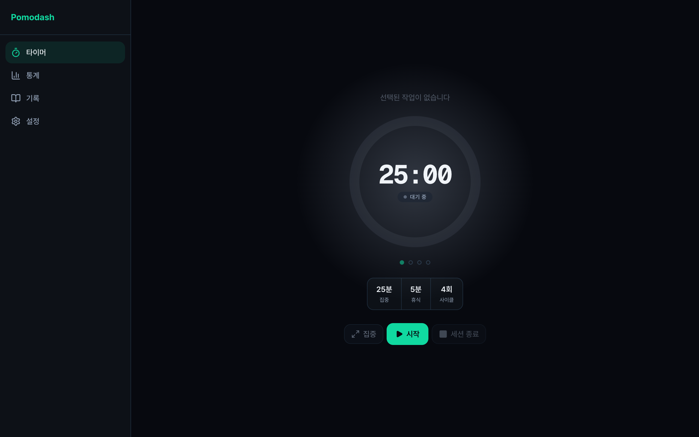
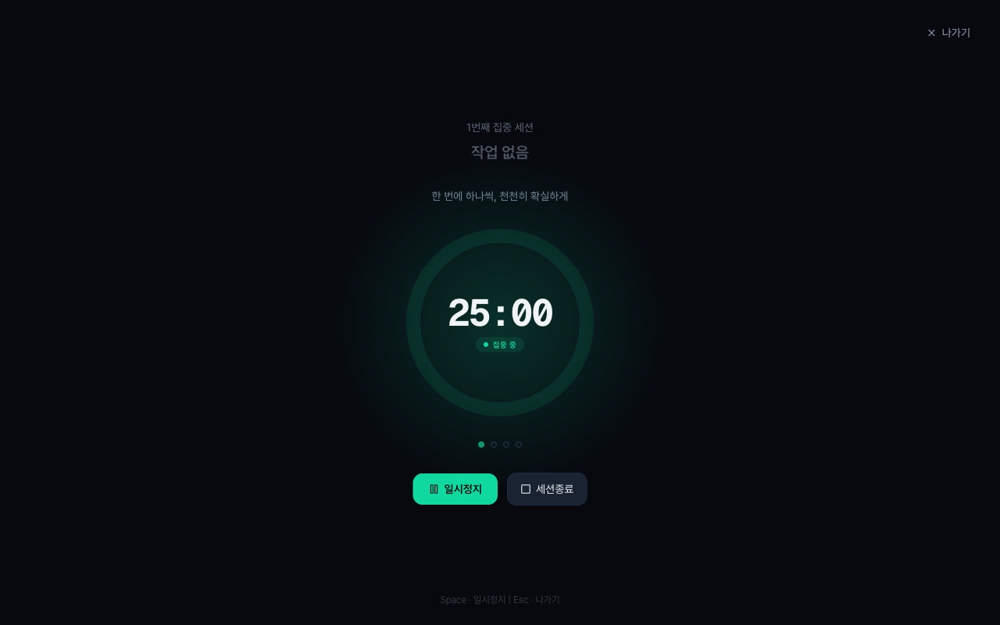
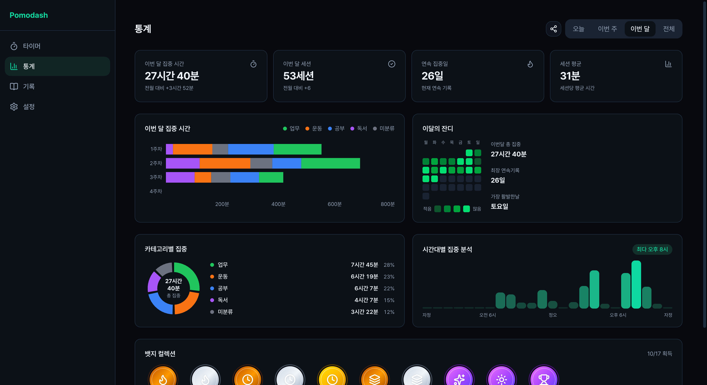

# Pomodash

[](https://pomodash-three.vercel.app) [](./LICENSE)

계획하고, 집중하고, 기록한다

수험생과 취업 준비생을 위한 포모도로 기반 집중 도구.

## 스크린샷

<div align="center">
  
  
  
</div>

## 주요 기능

| | 기능 | 설명 |
|---|---|---|
| ⏱ | **포모도로 타이머** | 절대시간 기반, 백그라운드 탭 드리프트 없음 |
| 📋 | **작업 관리** | 카테고리별 작업 생성 및 목표 사이클 설정 |
| 🎯 | **집중 모드** | 타이머만 남기고 방해 요소 최소화 |
| 📝 | **세션 기록** | 회고 메모·집중도·방해요소 태그 + 집중 구간 타임라인 |
| 📊 | **대시보드** | 일/주/월/전체 집중 시간 시각화, 스트릭, 카테고리별·시간대별 분석 |
| 🏆 | **뱃지 컬렉션** | 스트릭·누적 시간·다양성 뱃지 수집 |
| 🔗 | **공유 카드** | 집중 요약을 이미지로 생성해 공유 |
| 🔐 | **계정 동기화** | 이메일·카카오 로그인, 기기 간 데이터 자동 동기화 |
| 📱 | **웹 + 모바일** | Next.js 웹, React Native(Expo) 앱 동시 지원 — 픽셀 단위 동일 UI |
| 🌙 | **다크/라이트 모드** | 시스템 설정 연동, 수동 전환 가능 |

## 개발 가이드

### 요구사항

Node.js 22+, pnpm 11+

### 설치 및 실행

```bash
git clone https://github.com/aaaz425/pomodash.git
cd pomodash
pnpm install
pnpm dev                      # 웹 (apps/web) → http://localhost:3000
pnpm --filter mobile start    # 모바일 (Expo)
```

### 명령어

| 명령어 | 설명 |
|--------|------|
| `pnpm dev` | 웹 로컬 개발 서버 |
| `pnpm build` | 웹 프로덕션 빌드 (커밋 전 통과 확인) |
| `pnpm lint` | 전체 워크스페이스 린트 |
| `pnpm test` | 단위 테스트 (Vitest) |
| `pnpm test:e2e` | E2E 테스트 (Playwright) |
| `pnpm --filter mobile start` | Expo 개발 서버 |

### 프로젝트 구조

pnpm workspace + Turborepo 모노레포.

```
apps/
  web/           # Next.js 웹 앱
  mobile/        # React Native(Expo) 앱
packages/
  shared/        # 웹·모바일 공유 순수 로직 (타이머 계산, 대시보드 집계, 뱃지 등)
docs/            # 프로젝트 문서 (웹·모바일 공통)
supabase/        # DB 스키마, RLS 정책, Edge Functions
```

### 산출물 (Specs)

| 문서 | 내용 |
|------|------|
| [PRD](docs/specs/PRD.md) | 제품 목표, 사용자 페르소나, 핵심 기능 요구사항 |
| [ERD](docs/specs/ERD.md) | 데이터 모델 및 관계도 |
| [기능 명세](docs/specs/feature-spec.md) | 기능별 상세 명세 및 유저 스토리 |
| [화면 명세](docs/specs/screen-spec.md) | 화면별 레이아웃 및 상호작용 |
| [아키텍처](docs/specs/architecture-diagram.md) | 기술 선택 이유, Mermaid 구조도 |

### 개발 가이드 (Guides)

| 문서 | 내용 |
|------|------|
| [용어집](docs/guides/glossary.md) | 작업·세션·사이클·페이즈 등 도메인 용어 정의 |
| [컨벤션](docs/guides/conventions.md) | 폴더 구조, 네이밍, 컴포넌트 재활용 원칙 |
| [데이터 모델](docs/guides/data-models.md) | 타입 정의, Supabase 스키마 및 접근 패턴 |
| [디자인 시스템](docs/guides/design.md) | 색상, 타이포, 컴포넌트 디자인 시스템 |
| [커밋 컨벤션](docs/guides/commit-convention.md) | 브랜치 전략, 커밋 컨벤션, PR 규칙 |
| [테스트 전략](docs/guides/testing.md) | Vitest + Playwright 테스트 전략 |
| [로드맵](docs/roadmap.md) | 구현 로드맵 및 진행 현황 |

## 기술 스택

| 기술 | 용도 |
|------|------|
| Next.js 16 | 웹 앱, App Router |
| React Native (Expo) | 모바일 앱, Expo Router |
| Tailwind CSS + shadcn/ui | 웹 UI 구성 및 디자인 시스템 |
| Zustand | 타이머/작업/설정 전역 상태 관리 (웹·모바일 공유 패턴) |
| Zod | 입력·저장 데이터 런타임 검증 |
| Supabase | 인증·DB·기기 간 동기화 (Postgres + RLS) |
| Recharts / react-native-gifted-charts | 대시보드 차트 (웹/모바일) |
| date-fns | 날짜 그루핑 및 스트릭 계산 |
| framer-motion / react-native-reanimated | 집중 모드 전환 애니메이션 |
| Turborepo + pnpm workspace | 모노레포 빌드·태스크 관리 |
| Vercel / Vercel Analytics | 웹 배포 및 사용 지표 모니터링 |

## 라이선스

[MIT](./LICENSE) © 2026
