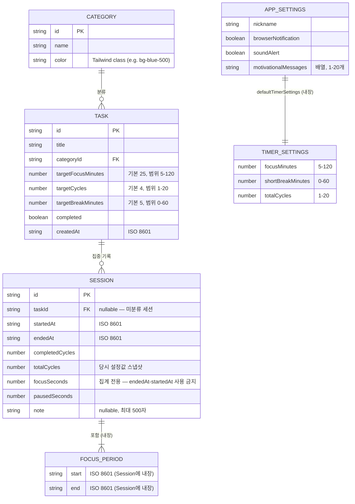

# ERD — Entity Relationship Diagram

> **버전:** 1.0 · **기준:** `types/index.ts` (localStorage MVP 기준, Supabase 마이그레이션 전)
> **저장소:** 브라우저 localStorage (서버 DB 없음)

---

## 개요

Pomodash는 서버 DB 없이 localStorage만 사용한다. 엔티티 간 관계는 외래 키 ID로 참조하고 런타임에 Zod 스키마로 검증한다. FocusPeriod는 Session에 내장(embedded)되어 별도 키로 저장되지 않는다.

---

## 관계도

---

## 엔티티 상세

### Category

| 필드 | 타입 | 제약 | 설명 |
|------|------|------|------|
| `id` | string | PK | UUID 또는 고정 ID |
| `name` | string | - | 표시 이름 |
| `color` | string | - | Tailwind 클래스 (예: `bg-blue-500`) |

**기본값:** 공부(blue), 업무(green), 운동(orange), 독서(purple), 기타(gray)

---

### Task

| 필드 | 타입 | 제약 | 설명 |
|------|------|------|------|
| `id` | string | PK | UUID |
| `title` | string | - | 작업 이름 |
| `categoryId` | string | FK → Category | 카테고리 참조 |
| `targetFocusMinutes` | number | 5–120 | 사이클당 집중 시간 |
| `targetCycles` | number | 1–20 | 목표 사이클 수 |
| `targetBreakMinutes` | number | 0–60 | 사이클 간 휴식 시간 |
| `completed` | boolean | - | 완료 여부 |
| `createdAt` | string | ISO 8601 | 생성 시각 |

---

### Session

| 필드 | 타입 | 제약 | 설명 |
|------|------|------|------|
| `id` | string | PK | UUID |
| `taskId` | string \| null | FK → Task | null = 미분류 세션 |
| `startedAt` | string | ISO 8601 | 세션 최초 시작 시각 |
| `endedAt` | string | ISO 8601 | 세션 종료 시각 |
| `completedCycles` | number | - | 실제 완료 사이클 수 |
| `totalCycles` | number | - | 당시 설정값 스냅샷 |
| `focusSeconds` | number | - | **집계 전용** (pausedSeconds 제외) |
| `pausedSeconds` | number | - | 총 일시정지 시간 |
| `focusPeriods` | FocusPeriod[] | - | 타임라인 블록용 실제 집중 구간 |
| `note` | string \| null | 최대 500자 | 세션 회고 메모 |

> **주의:** `focusSeconds`만 집계에 사용. `endedAt - startedAt`은 일시정지를 포함한 경과 시간이므로 통계에 쓰면 안 된다.

---

### FocusPeriod (Session 내장)

Session의 `focusPeriods` 배열 원소. 별도 localStorage 키 없음.

| 필드 | 타입 | 설명 |
|------|------|------|
| `start` | string (ISO 8601) | 집중 구간 시작 |
| `end` | string (ISO 8601) | 집중 구간 종료 |

**정규화 규칙 (`lib/focusPeriods.ts`):**
- 5초 미만 구간 드롭 (노이즈 제거)
- 5초 이하 일시정지로 나뉜 인접 구간 병합
- 최대 100개 구간 상한

---

### TimerSettings (AppSettings 내장)

| 필드 | 타입 | 범위 | 기본값 |
|------|------|------|--------|
| `focusMinutes` | number | 5–120 | 25 |
| `shortBreakMinutes` | number | 0–60 | 5 |
| `totalCycles` | number | 1–20 | 4 |

---

### AppSettings

| 필드 | 타입 | 설명 |
|------|------|------|
| `nickname` | string | 사용자 닉네임 |
| `browserNotification` | boolean | 브라우저 알림 on/off |
| `soundAlert` | boolean | 소리 알람 on/off |
| `motivationalMessages` | string[] | 동기부여 메시지 목록 (1–20개) |
| `defaultTimerSettings` | TimerSettings | 세션 시작 시 기본 적용값 |

---

## localStorage 키 매핑

| 엔티티 | localStorage 키 | 형태 |
|--------|-----------------|------|
| Category[] | `pomodash:categories` | JSON 배열 |
| Task[] | `pomodash:tasks` | JSON 배열 |
| Session[] | `pomodash:sessions` | JSON 배열 (FocusPeriod 내장) |
| AppSettings | `pomodash:settings` | JSON 객체 |
| TimerSettings (런타임) | `pomodash:timer-settings` | JSON 객체 |
| 스키마 버전 | `pomodash:version` | 숫자 문자열 |

---

## 스키마 버전 관리

- `pomodash:version` 값이 현재 버전과 다르면 localStorage 전체 초기화 또는 마이그레이션 실행
- 현재 버전: **1**
- 버전 업그레이드 시 기존 사용자 데이터 유실 가능 → 마이그레이션 로직 필수

---

## Phase 7 이후 변경 예정

Supabase 마이그레이션 시:
- localStorage 키 → Supabase 테이블로 전환
- `taskId` nullable FK → Supabase foreign key constraint
- `focusPeriods` 내장 배열 → 별도 `focus_periods` 테이블로 정규화 가능

