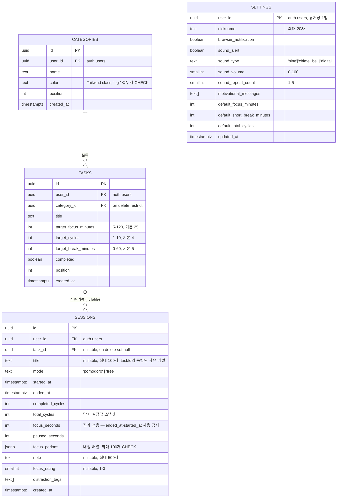

# ERD — Entity Relationship Diagram

> **버전:** 2.0 · **기준:** Supabase Postgres (`supabase/migrations/`), RLS로 `auth.uid() = user_id` 전 테이블 적용

---

## 관계도

```mermaid
erDiagram
    CATEGORIES {
        uuid id PK
        uuid user_id FK "auth.users"
        text name
        text color "Tailwind class, 'bg-' 접두사 CHECK"
        int position
        timestamptz created_at
    }

    TASKS {
        uuid id PK
        uuid user_id FK "auth.users"
        uuid category_id FK "on delete restrict"
        text title
        int target_focus_minutes "5-120, 기본 25"
        int target_cycles "1-10, 기본 4"
        int target_break_minutes "0-60, 기본 5"
        boolean completed
        int position
        timestamptz created_at
    }

    SESSIONS {
        uuid id PK
        uuid user_id FK "auth.users"
        uuid task_id FK "nullable, on delete set null"
        text title "nullable, 최대 100자, taskId와 독립된 자유 라벨"
        text mode "'pomodoro' | 'free'"
        timestamptz started_at
        timestamptz ended_at
        int completed_cycles
        int total_cycles "당시 설정값 스냅샷"
        int focus_seconds "집계 전용 — ended_at-started_at 사용 금지"
        int paused_seconds
        jsonb focus_periods "내장 배열, 최대 100개 CHECK"
        text note "nullable, 최대 500자"
        smallint focus_rating "nullable, 1-3"
        text[] distraction_tags
        timestamptz created_at
    }

    SETTINGS {
        uuid user_id PK "auth.users, 유저당 1행"
        text nickname "최대 20자"
        boolean browser_notification
        boolean sound_alert
        text sound_type "'sine'|'chime'|'bell'|'digital'"
        smallint sound_volume "0-100"
        smallint sound_repeat_count "1-5"
        text[] motivational_messages
        int default_focus_minutes
        int default_short_break_minutes
        int default_total_cycles
        timestamptz updated_at
    }

    CATEGORIES ||--o{ TASKS : "분류"
    TASKS |o--o{ SESSIONS : "집중 기록 (nullable)"
```

`focus_periods`는 정규화하지 않고 `jsonb`로 내장한다 — 항상 부모 세션과 함께만 조회/집계되어 별도 테이블화 이득이 없다(`packages/shared/src/lib/focusPeriods.ts`, `dashboard.ts`). 정규화 규칙: 5초 미만 구간 드롭, 5초 이하 일시정지로 나뉜 인접 구간 병합, 최대 100개 상한.

TypeScript 인터페이스는 `types/models.ts`(웹)/`types/*.ts`(모바일), Zod 스키마는 `types/schemas.ts`에 대응한다. 필드 상세 제약: [docs/guides/data-models.md](../guides/data-models.md)

---

## RLS 및 트리거

- 전 테이블 `select`/`insert`/`update`/`delete`를 `auth.uid() = user_id`로 제한, `authenticated` 롤에만 권한 부여(로그인 필수, `anon` 권한 없음)
- `tasks.category_id`는 `on delete restrict` — 참조하는 task가 있으면 카테고리 삭제가 막힌다(웹/앱 UX에서 안내)
- `sessions.task_id`는 `on delete set null` — 작업 삭제 시 세션은 "미분류"로 남는다
- `handle_new_user()` 트리거: 신규 계정 생성 시 기본 카테고리 5개 + 기본 `settings` 1행을 원자적으로 시딩(닉네임은 카카오 프로필 닉네임 또는 이메일 로컬 파트)

---

## 기기 로컬 저장소 (Supabase 미러링 아님)

Task/Category/Session/AppSettings는 Supabase가 단일 진실 원천이다. 기기 로컬 저장소에는 새로고침/재시작 복구용 활성 타이머 스냅샷과 테마만 남는다 — 키 목록과 검증 패턴은 [docs/guides/data-models.md](../guides/data-models.md) 참조.

---

## 참조

- 마이그레이션 원본: `supabase/migrations/`
- 데이터 모델 상세(타입/기본값/localStorage 키): [docs/guides/data-models.md](../guides/data-models.md)
