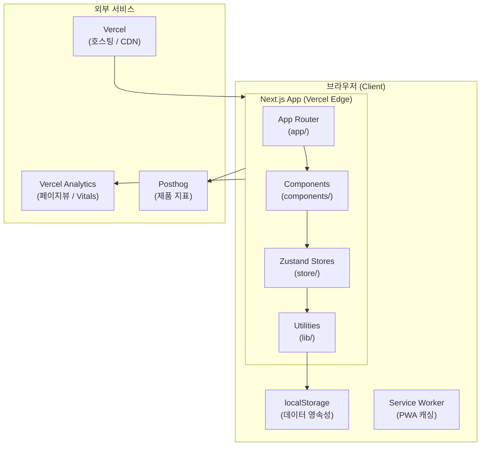
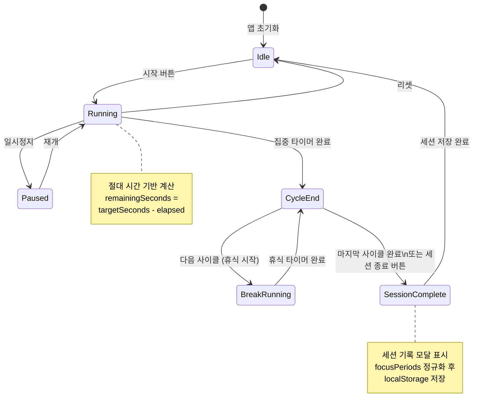
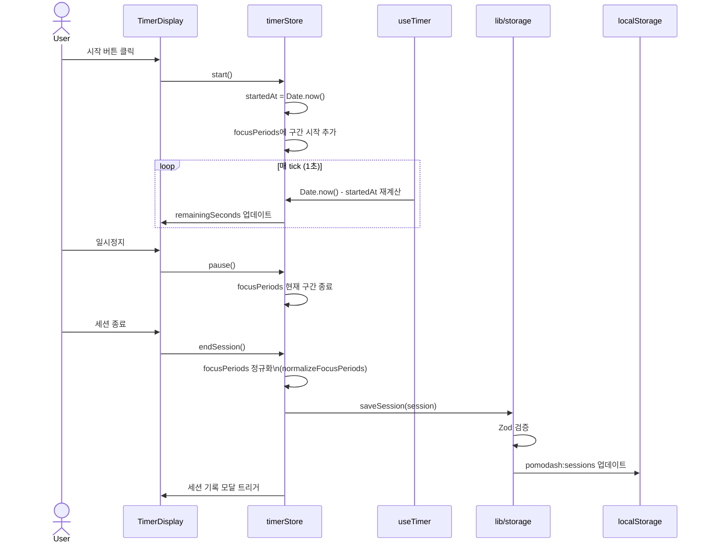

# 아키텍처 구조도

> **버전:** 1.0 · **기준:** Next.js App Router + localStorage MVP

---

## 1. 시스템 전체 구조

---

## 2. 컴포넌트 의존성 계층

단방향 의존만 허용한다. `lib/`에서 `components/`나 `app/`을 import하는 역방향 의존은 금지한다.

```mermaid
flowchart LR
    subgraph app["app/ (라우팅)"]
        Pages["page.tsx\nlayout.tsx"]
    end

    subgraph components["components/ (UI)"]
        Feature["feature/\n(timer, tasks, dashboard\njournal, settings, landing)"]
        Shared["shared/\n(공유 컴포넌트)"]
        UI["ui/\n(shadcn/ui)"]
    end

    subgraph hooks["hooks/ (브라우저 API 추상화 + 재사용 로직)"]
        UseTimer["useTimer"]
        UseCurrentTask["useCurrentTask"]
        UseSessionEndFlow["useSessionEndFlow"]
        UseTheme["useTheme 등"]
    end

    subgraph store["store/ (전역 상태)"]
        TimerStore["timerStore"]
        TaskStore["taskStore"]
        SettingsStore["settingsStore"]
    end

    subgraph config["config/ (앱 설정)"]
        Site["site.ts"]
        Analytics["analytics.ts"]
    end

    subgraph lib["lib/ (도메인 로직·유틸)"]
        Constants["constants/\n(상수 SSOT)"]
        Storage["storage.ts"]
        Notifications["notifications.ts"]
        FocusPeriods["focusPeriods.ts"]
        Dashboard["dashboard.ts / journalInsights.ts"]
        Badges["badges.ts"]
        ShareCard["shareCard.ts / shareCardCanvas.ts"]
        SessionUtils["sessionUtils.ts / sessionStale.ts"]
    end

    subgraph types["types/"]
        Models["models.ts\n(인터페이스)"]
        Schemas["schemas.ts\n(Zod 스키마)"]
    end

    Pages --> Feature
    Pages --> Shared
    Feature --> UI
    Shared --> UI
    Feature --> hooks
    Shared --> hooks
    Feature --> store
    Shared --> store
    hooks --> store
    hooks --> lib
    store --> lib
    store --> types
    lib --> types
```

---

## 3. 타이머 상태 기계

---

## 4. 세션 데이터 흐름

---

## 6. 스토어 구성 및 역할

| 스토어 | 파일 | 주요 상태 | 주요 액션 |
|--------|------|-----------|-----------|
| timerStore | `store/timerStore.ts` | phase, mode, startedAt, remainingSeconds, cycleCount, currentTaskId, rawFocusPeriods | start, pause, complete, reset, completeCycle, endSession |
| taskStore | `store/taskStore.ts` | tasks[], categories[], sessions[] | addTask, updateTask, deleteTask, addSession, updateSessionNote/Rating/Tags, addCategory, deleteCategory |
| settingsStore | `store/settingsStore.ts` | AppSettings 필드를 평탄화해서 개별 상태로 보관(nickname, soundType 등) | setNickname, setTimerDefaults, setSoundType, addMessage 등 |

모든 스토어는 `createStore()` 팩토리 패턴을 쓴다 (SSR 싱글톤 버그 방지). 참조: `docs/guides/conventions.md` — Zustand 스토어 패턴

---

## 참조

- 폴더 구조 규칙: [docs/guides/conventions.md](../guides/conventions.md)
- 데이터 모델: [docs/specs/ERD.md](ERD.md)

