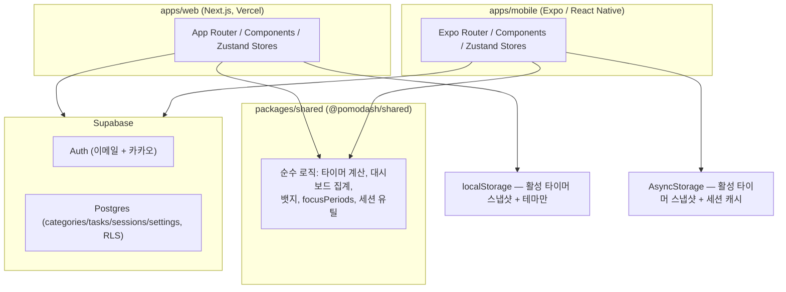
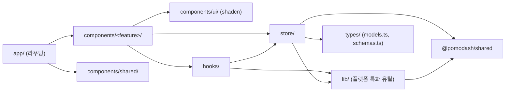
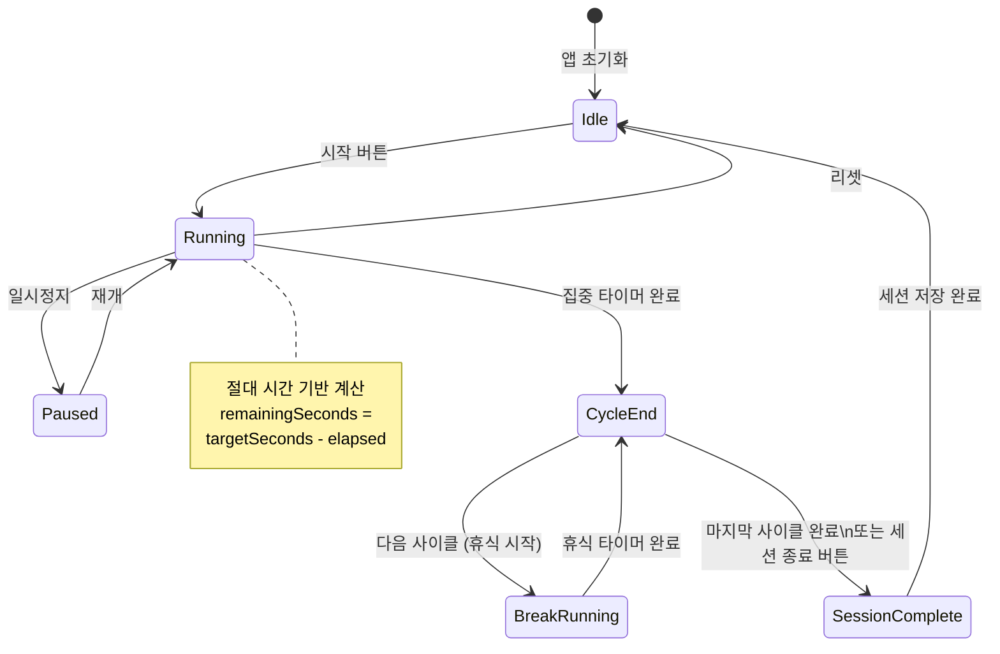
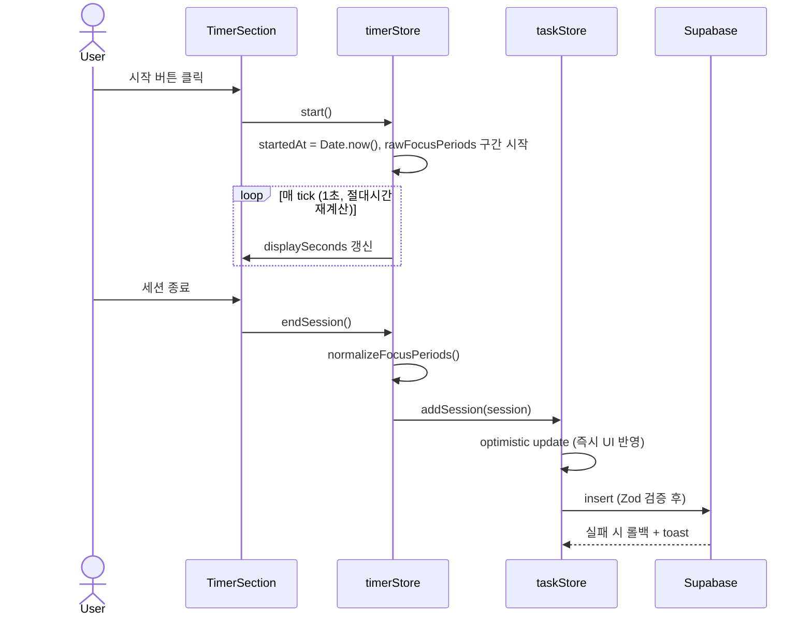

# 아키텍처 구조도

> **버전:** 2.0 · **기준:** pnpm 모노레포 + Supabase 백엔드 (Phase 7·8 완료)

---

## 1. 시스템 전체 구조

```mermaid
flowchart TB
    subgraph Web["apps/web (Next.js, Vercel)"]
        WebApp["App Router / Components / Zustand Stores"]
    end
    subgraph Mobile["apps/mobile (Expo / React Native)"]
        MobileApp["Expo Router / Components / Zustand Stores"]
    end
    subgraph Shared["packages/shared (@pomodash/shared)"]
        SharedLib["순수 로직: 타이머 계산, 대시보드 집계,\n뱃지, focusPeriods, 세션 유틸"]
    end

    subgraph Supabase["Supabase"]
        Auth["Auth (이메일 + 카카오)"]
        DB["Postgres (categories/tasks/sessions/settings, RLS)"]
    end

    WebApp --> SharedLib
    MobileApp --> SharedLib
    WebApp --> Supabase
    MobileApp --> Supabase

    LS["localStorage — 활성 타이머 스냅샷 + 테마만"]
    AS["AsyncStorage — 활성 타이머 스냅샷 + 세션 캐시"]
    WebApp --> LS
    MobileApp --> AS
```

Task/Category/Session/AppSettings는 Supabase가 단일 진실 원천이다. 기기 로컬 저장소(localStorage/AsyncStorage)에는 새로고침 복구용 활성 타이머 스냅샷과 테마만 남는다.

---

## 2. 컴포넌트 의존성 계층 (apps/web 기준)

단방향 의존만 허용한다. `lib/`에서 `components/`나 `app/`을 import하는 역방향 의존은 금지한다. apps/mobile도 동일한 계층 규칙을 따르며, 플랫폼 무관 순수 로직은 `packages/shared`로 뽑는다.

```mermaid
flowchart LR
    Pages["app/ (라우팅)"] --> Feature["components/&lt;feature&gt;/"]
    Pages --> Shared["components/shared/"]
    Feature --> UI["components/ui/ (shadcn)"]
    Feature --> hooks["hooks/"]
    Feature --> store["store/"]
    hooks --> store
    hooks --> lib["lib/ (플랫폼 특화 유틸)"]
    store --> lib
    store --> SharedPkg["@pomodash/shared"]
    lib --> SharedPkg
    store --> types["types/ (models.ts, schemas.ts)"]
```

---

## 3. 타이머 상태 기계

```mermaid
stateDiagram-v2
    [*] --> Idle : 앱 초기화

    Idle --> Running : 시작 버튼
    Running --> Paused : 일시정지
    Paused --> Running : 재개
    Running --> Idle : 리셋

    Running --> CycleEnd : 집중 타이머 완료
    CycleEnd --> BreakRunning : 다음 사이클 (휴식 시작)
    BreakRunning --> CycleEnd : 휴식 타이머 완료

    CycleEnd --> SessionComplete : 마지막 사이클 완료\n또는 세션 종료 버튼

    SessionComplete --> Idle : 세션 저장 완료

    note right of Running
        절대 시간 기반 계산
        remainingSeconds =
        targetSeconds - elapsed
    end note
```

---

## 4. 세션 데이터 흐름

```mermaid
sequenceDiagram
    actor User
    participant Timer as TimerSection
    participant Store as timerStore
    participant Task as taskStore
    participant Supa as Supabase

    User->>Timer: 시작 버튼 클릭
    Timer->>Store: start()
    Store->>Store: startedAt = Date.now(), rawFocusPeriods 구간 시작

    loop 매 tick (1초, 절대시간 재계산)
        Store->>Timer: displaySeconds 갱신
    end

    User->>Timer: 세션 종료
    Timer->>Store: endSession()
    Store->>Store: normalizeFocusPeriods()
    Store->>Task: addSession(session)
    Task->>Task: optimistic update (즉시 UI 반영)
    Task->>Supa: insert (Zod 검증 후)
    Supa-->>Task: 실패 시 롤백 + toast
```

---

## 5. 스토어 구성

| 스토어 | 주요 상태 | 주요 액션 |
|--------|-----------|-----------|
| timerStore | phase, mode, startedAt, remainingSeconds, cycleCount, rawFocusPeriods | start, pause, complete, reset, endSession |
| taskStore | tasks[], categories[], sessions[] | addTask, updateTask, deleteTask, addSession, updateSessionFields, addCategory, deleteCategory |
| settingsStore | AppSettings 필드 (nickname, soundType 등) | setNickname, setTimerDefaults, setSoundType, addMessage 등 |

세 스토어 모두 `createStore()` 팩토리 패턴을 쓴다(SSR/RN 양쪽에서 싱글톤 버그 방지). 그중 `timerStore`만 `packages/shared`의 `createTimerStore(ports)`를 웹/모바일 각자 감싸 localStorage/AsyncStorage 포트를 주입하고, `taskStore`/`settingsStore`는 플랫폼별로 각자 구현한다(Supabase 클라이언트 호출 방식 차이). 참조: [conventions.md](../guides/conventions.md)

---

## 6. 참조

- 폴더 구조 규칙: [docs/guides/conventions.md](../guides/conventions.md)
- 데이터 모델 / Supabase 스키마: [docs/specs/ERD.md](ERD.md)
